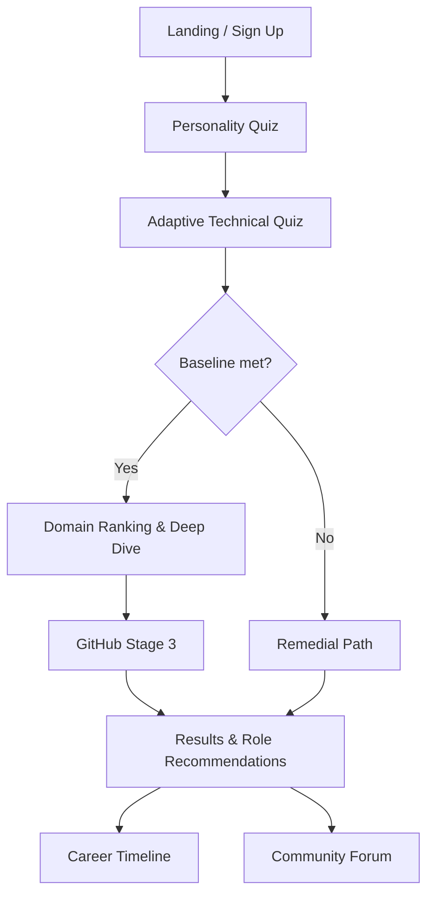

# Apna Career

**Discover your best-fit engineering path** with adaptive quizzes, deep skill mapping, and personalized career roadmaps.

Apna Career is an AI-guided assessment platform built for engineering students. It combines personality profiling, an adaptive technical quiz powered by Bayesian Knowledge Tracing (BKT), and GitHub project evaluation to recommend domains, roles, and next steps.

---

## Features

- **Personality Assessment (Stage 1)** — RIASEC-inspired questionnaire that sets soft domain priors without blocking any path
- **Adaptive Technical Quiz (Stage 2)** — Multi-phase quiz across DSA, Web Development, Machine Learning, and Systems with difficulty that adapts to your answers
- **GitHub Evaluation (Stage 3)** — Analyzes real projects and generates targeted follow-up questions to verify hands-on understanding
- **Results Dashboard** — Domain fit scores, Washington Accord attribute breakdown, skill gaps, and role recommendations
- **Career Timeline** — Personalized roadmap for your top-matched engineering roles
- **Community Forum** — Q&A, mentor matching, study buddy finder, and reality-check discussions
- **Progress Persistence** — Firebase-backed auth and Firestore storage so students can pause and resume anytime

---

## How It Works



### Assessment Pipeline

| Stage | What it measures | Output |
|-------|------------------|--------|
| **1 — Personality** | Cognitive traits, work style, risk preference | Personality vector + soft domain nudges |
| **2 — Adaptive Quiz** | Concept-level knowledge across 4 engineering domains | BKT beliefs, WA attribute profile, best-fit domain |
| **3 — GitHub** | Real-world project quality and authenticity | Targeted verification questions |

The quiz engine uses **Bloom's Taxonomy** (Remember → Create) and maps questions to **Washington Accord Graduate Attributes** (PO1–PO8) for competency profiling beyond raw correctness.

---

## Tech Stack

| Layer | Technologies |
|-------|--------------|
| **Frontend** | React 19, Vite, React Router, Tailwind CSS |
| **Charts** | Recharts |
| **Backend / Auth** | Firebase Authentication, Cloud Firestore |
| **Hosting** | Firebase Hosting |
| **AI (Stage 3)** | Groq API (for GitHub analysis) |
| **Evaluation** | Deterministic rubric-based NLP (no external LLM for quiz scoring) |

---

## Project Structure

```
apna_career-rebuild/
├── src/
│   ├── pages/           # Route-level screens (Landing, Quiz, Results, Forum, etc.)
│   ├── components/      # Shared UI (Navbar, ProtectedRoute, Toast)
│   ├── engine/          # Core logic (BKT, rubric, personality, result generation)
│   ├── data/            # Question banks and personality questions
│   ├── firebase.js      # Firebase client initialization
│   └── App.jsx          # Route definitions
├── questionnaire/       # Domain-phase question JSON files
├── public/roles/          # Role mapping data
├── firestore.rules        # Firestore security rules
├── firebase.json          # Firebase project config
└── docs/                  # Design specs (see Documentation below)
```

---

## Routes

| Path | Description | Auth required |
|------|-------------|---------------|
| `/` | Landing page | No |
| `/auth` | Login / sign up | No |
| `/dashboard` | Assessment home & progress | Yes |
| `/personality` | Stage 1 personality quiz | Yes |
| `/quiz/intro` | Quiz instructions | Yes |
| `/quiz` | Stage 2 adaptive quiz | Yes |
| `/quiz/stage3` | Stage 3 GitHub evaluation | Yes |
| `/results` | Full assessment results | Yes |
| `/timeline` | Career roadmap | Yes |
| `/forum` | Community hub | Yes |

---

## Domains Assessed

- **DSA** — Data structures, algorithms, complexity
- **Web Development** — Frontend, backend, and full-stack concepts
- **Machine Learning** — Models, training, evaluation
- **Systems** — OS, networking, architecture

---

## Getting Started

### Prerequisites

- [Node.js](https://nodejs.org/) 18+ and npm
- A [Firebase](https://firebase.google.com/) project with Authentication and Firestore enabled
- (Optional) A [Groq](https://groq.com/) API key for Stage 3 GitHub evaluation

### Installation

```bash
# Clone the repository
git clone https://github.com/AbhinavPamadi/apna_career-rebuild.git
cd apna_career-rebuild

# Install dependencies
npm install
```

### Environment Variables

Copy the example env file and fill in your Firebase credentials:

```bash
cp .env.example .env
```

| Variable | Description |
|----------|-------------|
| `VITE_FIREBASE_API_KEY` | Firebase Web API key |
| `VITE_FIREBASE_AUTH_DOMAIN` | Firebase auth domain |
| `VITE_FIREBASE_PROJECT_ID` | Firebase project ID |
| `VITE_FIREBASE_STORAGE_BUCKET` | Firebase storage bucket |
| `VITE_FIREBASE_MESSAGING_SENDER_ID` | Firebase messaging sender ID |
| `VITE_FIREBASE_APP_ID` | Firebase app ID |
| `VITE_GROQ_API_KEY` | Groq API key (Stage 3 only) |
| `VITE_GROQ_MODEL` | Groq model name (default: `llama-3.3-70b-versatile`) |

### Firebase Setup

1. Create a Firebase project and enable **Email/Password** and **Google** sign-in under Authentication.
2. Create a Firestore database in production mode.
3. Deploy security rules and indexes:

```bash
firebase login
firebase use <your-project-id>
firebase deploy --only firestore:rules,firestore:indexes
```

4. Add your app's domain to Firebase **Authorized domains** if deploying to production.

### Run Locally

```bash
npm run dev
```

Open [http://localhost:5173](http://localhost:5173) in your browser.

---


